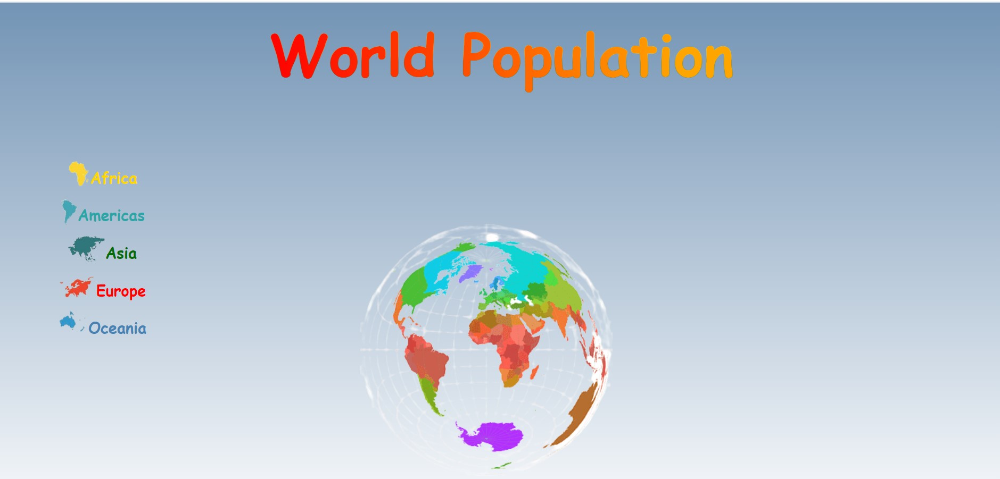

# -World-Population--week-7


Creating a website to compare populations in different places. using ```html```, ```css``` and ```vanilla Javascript```.

# Demo site line: 


# About the website:
- The user to can choose statistics between continents.
When the user selects a continent:
a. the distribution of the population in each country will
appear on the graph.
b. We will show him a list of buttons for all the countries
on the same continent.
- When the user selects a country:
a. the distribution of the population in each city will
appear on the graph.


# ScreenShots

 
 
 

# Its responsive
 
 


